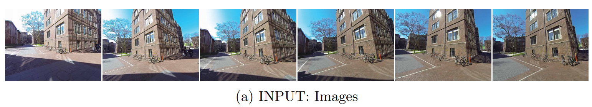
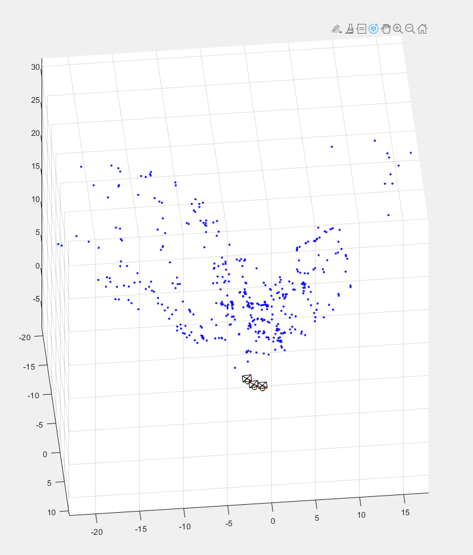

# Structure-from-motion

### What is structure from motion ###
Structure from Motion (SfM) is a technique which utilizes a series of 2-dimensional images to reconstruct the 3-dimensional structure of a scene or object.

### objectives ###
* Implement key elements of Structure from Motion(SfM) to compute camera pose and 3D point clouds of the scene.
* Task is to implement the key elements in the structure from motion: to estimate fundamental matrix and essential matrix, point triangulation, camera localization via PnP, and nonlinear refinement.

**data.mat** contains 2D  correspondences between three images, camera intrinsic parameter, and three images.  The correspondences are established by nearest neighbor search in SIFT local descriptors filtered by fundamental matrix based RANSAC.

### How to use ###
* clone the repository.
* Run the **run_sfm.m** file.

### Input images ###

### Result illustration ###

